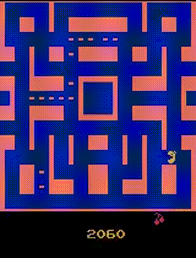

# Deep Q-Network (DQN) for Atari Games

This repository contains an implementation of the Deep Q-Network (DQN) algorithm for playing Atari games. The DQN algorithm, introduced by Mnih et al. in the paper [Playing Atari with Deep Reinforcement Learning](https://www.cs.toronto.edu/~vmnih/docs/dqn.pdf), combines Q-learning with deep neural networks to achieve impressive results in a variety of Atari 2600 games.

## Overview

### Deep Q-Network (DQN)

The Deep Q-Network is a deep reinforcement learning algorithm that extends Q-learning to handle high-dimensional state spaces. It employs a neural network to approximate the Q-function, which represents the expected cumulative future rewards for taking a specific action in a given state. This allows DQN to learn directly from raw sensory inputs, making it applicable to a wide range of tasks.

### Atari Games

The Atari 2600, a popular home video game console in the late 1970s and early 1980s, featured a diverse collection of games. These games serve as a benchmark for testing the capabilities of reinforcement learning algorithms. Each game in the Atari 2600 suite provides a unique environment with different challenges, making them an ideal testbed for training agents to generalize across a variety of tasks.

## Table of Contents

- [Introduction](#introduction)
- [Overview](#overview)
- [Getting Started](#getting-started)
  - [Prerequisites](#prerequisites)
  - [Installation](#installation)
- [Usage](#usage)
- [Training](#training)
- [Evaluation](#evaluation)
- [Results](#results)
- [Contributing](#contributing)
- [License](#license)

## Getting Started

### Prerequisites

To run this project, you will need the following:

- Python 3.x
- PyTorch
- Gym (OpenAI)

### Installation

1. Clone the repository:

```bash
git clone https://github.com/adhiiisetiawan/atari-dqn.git
```

2. Install the required dependencies:

```bash
pip install -r requirements.txt
```

## Usage

To train and evaluate the DQN agent, follow the steps outlined below:

1. Set up the required dependencies as described in the [Installation](#installation) section.

2. Train the DQN agent:

```bash
sh train.sh
```

If you want to change the game that you train, please edit the game environment name in `train.sh` file.

3. Evaluate the trained agent:

Evaluation process has been done during end of training, but if you want to run evaluation separately, just run `dqn_eval.py` and change the game environment.

## Training

The training process involves the following steps:

1. Preprocess raw game frames to reduce dimensionality.
2. Initialize a deep neural network to approximate the Q-function.
3. Initialize a replay buffer to store experiences.
4. For each episode, perform the following steps:
   - Select an action using an epsilon-greedy policy.
   - Execute the action in the environment and observe the next state, reward, and terminal flag.
   - Store the experience in the replay buffer.
   - Sample a batch of experiences from the replay buffer and perform a Q-learning update step.
   - Update the target Q-network periodically.

## Evaluation

The evaluation process involves testing the trained DQN agent on a specific game. The agent's performance is measured in terms of the average score achieved over a specified number of episodes.

## Results

### Game: `Q-Bert`

Here's a GIF of the agent playing `Q-Bert`:


### Game: `MS PacMan`

Here's a GIF of the agent playing `MS PacMan`:




## License

This project is licensed under the MIT License - see the [LICENSE](LICENSE) file for details.
